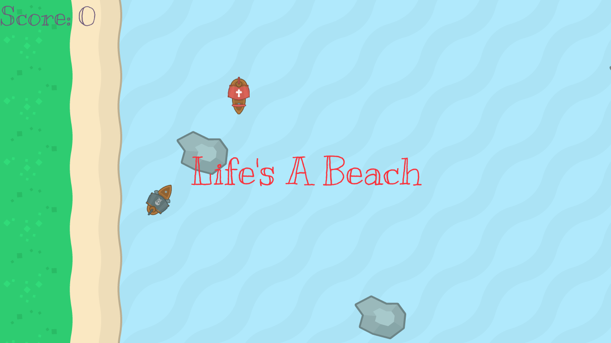
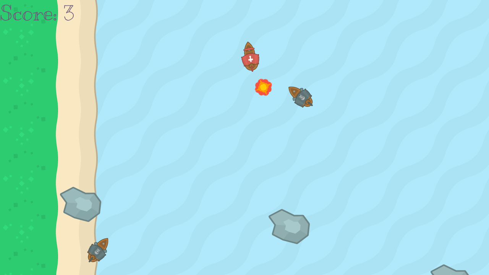
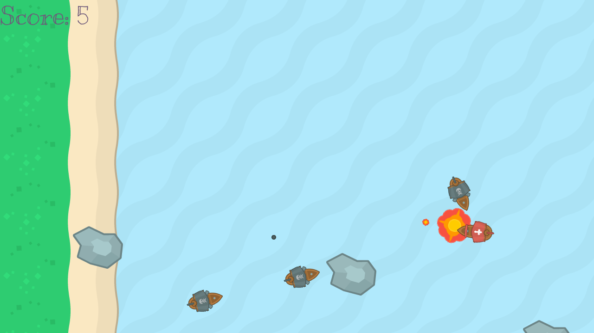

# Life's a Beach

## Screenshots

## Installation
1. Install pygame `pip3 install pygame`
2. Clone this repository
3. Run the `game.py`, `python3 game.py`

## Game Play Instructions
1. Use the `w` `a` `s` `d` keys to move the ship
2. Press `spacebar` to shoot the cannon

## To Do List
- [ ] Make enemy ships shoot
- [ ] Display an instruction screen
- [ ] Make a Lives counter
- [x] Make enemy ships follow me

